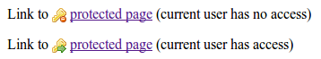

.. ==================================================
.. FOR YOUR INFORMATION
.. --------------------------------------------------
.. -*- coding: utf-8 -*- with BOM.

.. include:: ../Includes.txt

.. _introduction:

Introduction
============

.. _what-it-does:

What does it do?
----------------

This Extension consists of two different areas.

The first area is the highlighting of different link types (e.g. links
to access restricted pages or links to which the user has no access.

The other area is an improved error handling including the detection
of 403 (Forbidden) errors and a redirection of non logged in users
to the login page on 403 errors.

Link type detection
~~~~~~~~~~~~~~~~~~~

This Extension provides a user function that determines the link type.

Currently it can **only be used inside a parseFunc** call.

These link types are currently detected:

============================= ======================================================
Link type                     Description
============================= ======================================================
External                      Non page link (can also be email, file etc.)
PageNonExisting               Link to a page that does not exist
PageRestrictedAccessDenied    Link to a page, user is logged in and has no access
PageRestrictedAccessGranted   Link to a page, user is logged in and has acces.
PageRestrictedAccessUndecided Link to an access restricted page, no user logged in
PageUnrestricted              Link to a page with no access restrictions
============================= ======================================================

See also :php:`Tx\Linktypeswitch\Domain\Model\Enumeration\LinkType`.

Error handling
~~~~~~~~~~~~~~

The error handling will improve the detection of the error type in the
Frontend. This means that when a page is not accessible because it is
protected the user will get a 403 (Forbidden) error instead of a 400
(Not found).

Additinally a user can be redirected to the login page when he accesses
a protected page and is not logged in.

Please note that these features need configuration in the Extension
Manager and in the TypoScript template. You can find more information
in the administration and the configuration sections of this manual.

.. _screenshots:

Screenshots
-----------

You can use the Extension to highlight links that point to access restricted pages.
It comes with examle styles that use some
`famfamfam silk <http://www.famfamfam.com/lab/icons/silk/>`_ icons:

The screenshot shows the example styles for two link types that are available if a user is logged in:

- link to a page to which the current user has no access
- link to a page to which the current user has access
